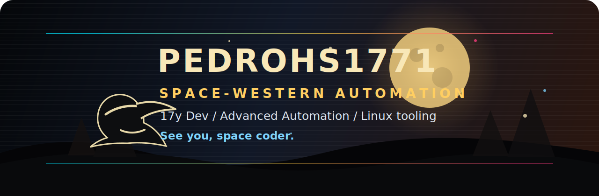

<p align="center">
  
</p>

<p align="center">
  <a href="https://github.com/Pedrohs1771">
    
  </a>
</p>

<p align="center">
  
  
  
</p>

---

## 🛰️ Mission Control / Controle da Missão

**EN:** I build automation systems, Linux tools and game-compatibility utilities with a pragmatic mindset: make it work, make it reliable, make it feel good to use.

**PT-BR:** Eu crio automações, ferramentas Linux e utilitários de compatibilidade com foco direto: funcionar bem, ser confiável e parecer produto de verdade.

```text
call_sign      Pedrohs1771
age            17
base           Brasil
focus          Advanced automation, Linux tooling, launchers, bots
style          dark UI, terminal-first workflows, space-western energy
motto          "See you, space coder."
```

---

## ⚙️ Stack & Core Capabilities

<p align="center">
  
  
  
  
  
  
  
  
  
  
</p>

---

## 🚀 Main Project / Projeto Principal

<p align="center">
  <a href="https://github.com/Pedrohs1771/Luma-Tools">
    
  </a>
</p>

**Luma Tools** is my Linux-first toolkit for Steam/Proton workflows, automation, update delivery, Discord Rich Presence and library management.

**Luma Tools** é meu toolkit Linux-first para fluxos Steam/Proton, automação, updates, Discord Rich Presence e gerenciamento de biblioteca.

---

## 📡 Live Telemetry / Telemetria

<p align="center">
  
</p>

<p align="center">
  
  
</p>

<p align="center">
  
</p>

---

## 🧭 Current Signal / Sinal Atual

<!-- pulse:start -->
**Last profile sync:** `2026-06-03 16:52 UTC`

| Active signal | Repository | Stack |
|---|---|---|
| `Python` | [Luma-Tools](https://github.com/Pedrohs1771/Luma-Tools) | is a cross-platform launcher and library manager designed to give you total control over your... |
| `Python` | [Web-scrapper-providers](https://github.com/Pedrohs1771/Web-scrapper-providers) | a tool created to map a website's endpoints up to the player and return everything in a JSON |
| `Python` | [godeye](https://github.com/Pedrohs1771/godeye) | Advanced Security Research Tool for Web Analysis |
| `GLSL` | [Hyenzy-X-Anime-Scraper](https://github.com/Pedrohs1771/Hyenzy-X-Anime-Scraper) | A powerful all-in-one media scraper for Anime and Games with 4K Upscale (MPV) and Discord RPC. |
<!-- pulse:end -->

---

## 🏴‍☠️ Operating Mode / Modo de Operação

| EN | PT-BR |
|---|---|
| Build fast prototypes, then harden the parts that matter. | Criar protótipos rápido e blindar o que importa. |
| Prefer tools that repair themselves instead of failing silently. | Preferir ferramentas que se reparam em vez de falhar em silêncio. |
| UI should have identity, not default-template energy. | Interface precisa ter identidade, não cara de template genérico. |
| Logs are not decoration; logs are how you win the debugging fight. | Logs não são decoração; logs vencem a guerra do debug. |

---

## 🌑 Contact / Contato

<p align="center">
  <a href="https://github.com/Pedrohs1771">
    
  </a>
  <a href="https://discord.com/users/1459315858244632872">
    
  </a>
</p>

<p align="center">
  <sub>Original profile art direction: space-western, jazz-noir, terminal glow. No templates, no default energy.</sub>
</p>
